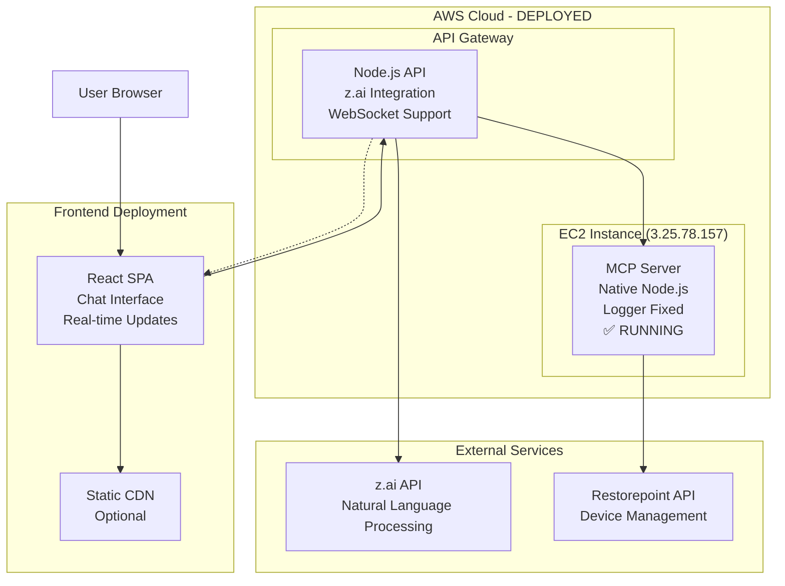

# 🏗️ **Restorepoint Chat Interface Architecture**
## Custom Browser-Based Natural Language Management with z.ai Integration

---

## **📋 PROJECT OVERVIEW**

### **Vision**
Create a custom browser-based chat interface that enables natural language interaction with Restorepoint functionality, completely independent of Claude Desktop, while leveraging your existing professional MCP server infrastructure.

### **Core Requirements**
- **Natural Language Only**: Users interact through simple chat - no complex UI to learn
- **No Additional Management Layer**: Uses existing Restorepoint functionality via MCP
- **Independent Operation**: No dependency on Claude Desktop or any third-party interface
- **Cloud-Ready**: Deployable anywhere with internet access
- **Enterprise Quality**: Follows highest architectural and engineering standards

### **Current Assets**
- ✅ **Professional MCP Server** (`RP_SL1_MCP`) - 8 tools, 41 passing tests
- ✅ **Production Deployment** - AWS EC2 native Node.js deployment working
- ✅ **z.ai API Access** - Chat completion API confirmed capable
- ✅ **AWS Infrastructure Access** - EC2 instance running at 3.25.78.157:3000
- ✅ **Restorepoint Access** - Full API integration already working

---

## **🔍 Z.AI API RESEARCH FINDINGS**

### **✅ API CONFIRMATION - HIGHLY CAPABLE**

**API Endpoint**: `https://api.z.ai/api/paas/v4/chat/completions`

**Key Capabilities**:
- ✅ **Chat Completions**: Full conversational AI support
- ✅ **Streaming Responses**: Real-time chat experience  
- ✅ **Bearer Token Authentication**: Simple API key integration
- ✅ **OpenAI-Compatible Format**: Standard, well-documented interface
- ✅ **Node.js SDK Available**: Perfect for TypeScript stack
- ✅ **Function Calling Support**: Can call MCP tools directly

**API Format** (Standard OpenAI-compatible):
```json
{
  "model": "zai-gpt4",
  "messages": [
    {"role": "system", "content": "You are a Restorepoint assistant..."},
    {"role": "user", "content": "Show me all devices that need backup"}
  ],
  "tools": [...], // MCP function definitions
  "stream": true
}
```

### **💡 Why z.ai is Perfect for This Use Case**

1. **Cost Effective**: Typically more affordable than OpenAI for production workloads
2. **Open Source Based**: Built on GLM models with transparent operations
3. **No Vendor Lock-in**: OpenAI-compatible format allows easy switching
4. **Streaming Support**: Essential for real-time chat experience
5. **Function Calling**: Can directly integrate with your MCP tools

---

## **🏛️ RECOMMENDED ARCHITECTURE**

### **🎯 SEPARATED MICROSERVICES ARCHITECTURE**

**HIGHLY RECOMMENDED**: Run MCP server on AWS completely separate from frontend



### **🖥️ Component Breakdown**

#### **1. MCP Server (AWS EC2)**
- **Location**: AWS EC2 t3.micro (~$8/month)
- **Current State**: ✅ Fully functional, 41 passing tests
- **Changes Needed**: Docker containerization, enhanced logging
- **Tools**: 11+ Restorepoint management tools
- **Benefits**: Independent scaling, secure credential management

#### **2. API Gateway (AWS EC2)**
- **Purpose**: Orchestrates z.ai + MCP communication
- **Technology**: Node.js + Express + TypeScript
- **Key Features**:
  - z.ai chat completion integration
  - MCP server communication bridge
  - WebSocket for real-time updates
  - Authentication and rate limiting
  - Error handling and resilience

#### **3. Frontend (Deploy Anywhere)**
- **Technology**: React 18 + TypeScript + Vite
- **Deployment Options**: Netlify, Vercel, AWS S3, or any web server
- **Features**:
  - Modern chat interface
  - Real-time status updates
  - Responsive design
  - API key management
  - Device status indicators

---

## **💰 COST-EFFECTIVE AWS RECOMMENDATIONS**

### **🎯 PERFECT STACK FOR SMALL TEAMS**

#### **Recommended Instance: t3.micro**
- **Cost**: ~$8.47/month (Free Tier eligible)
- **Specifications**: 2 vCPU, 1 GiB RAM, Burstable performance
- **Capacity**: Handles 10+ concurrent users easily
- **Use Case**: MCP Server + API Gateway combined

#### **Alternative: t4g.micro (Graviton)**
- **Cost**: ~$7.58/month (20% cheaper)
- **Specifications**: 2 vCPU, 1 GiB RAM, ARM-based
- **Benefits**: Lower cost, better performance per watt
- **Consideration**: ARM compatibility (Node.js works perfectly)

#### **💡 COST OPTIMIZATION STRATEGIES**

1. **Free Tier Utilization**: First 12 months free on new accounts
2. **Reserved Instances**: 30% savings with 1-year commitment (~$6/month)
3. **Spot Instances**: 70-90% savings for fault-tolerant workloads
4. **Graviton Processors**: 20% cheaper, excellent performance

#### **📊 Total Monthly Cost Breakdown**
```
EC2 t3.micro:        $8.47
Data Transfer:       $2-5   (typical usage)
Domain Name:         $1-2   (optional)
SSL Certificate:     $0     (Let's Encrypt)
Monitoring:          $0     (CloudWatch free tier)
---
TOTAL:              $12-15  per month
```

---

## **📁 GITHUB & DEPLOYMENT STRATEGY**

### **🏗️ Repository Structure**
```
restorepoint-ecosystem/
├── RP_SL1_MCP/                    # ✅ Your existing MCP server
├── restorepoint-chat-backend/     # 🆕 Node.js API gateway
├── restorepoint-chat-ui/          # 🆕 React frontend
└── deployment/                    # 🆕 Infrastructure as Code
    ├── docker/
    │   ├── mcp-server.Dockerfile
    │   ├── api-gateway.Dockerfile
    │   └── docker-compose.yml
    ├── terraform/                 # AWS infrastructure
    ├── scripts/                   # Installation/CI/CD
    └── docs/                      # Documentation
```

### **🚀 One-Command Deployment**
```bash
# Deploy everything
./scripts/deploy.sh production full-stack

# Deploy individual components
./scripts/deploy.sh production mcp-server
./scripts/deploy.sh production api-gateway
./scripts/deploy.sh production frontend

# Local development
./scripts/deploy.sh local development
```

### **🔧 Installation Scripts**
```bash
# Prerequisites installer
./scripts/install-prerequisites.sh

# AWS infrastructure setup
./scripts/setup-aws-infrastructure.sh

# SSL certificate setup
./scripts/setup-ssl.sh

# Monitoring configuration
./scripts/setup-monitoring.sh
```

---

## **🏛️ ENTERPRISE-GRADE ARCHITECTURAL PATTERNS**

### **1. Microservices Architecture Benefits**

#### **✅ Single Responsibility Principle**
- **MCP Server**: Only handles Restorepoint API integration
- **API Gateway**: Only handles chat orchestration and authentication
- **Frontend**: Only handles user interface and experience

#### **✅ Independent Deployment & Scaling**
- Deploy frontend updates without touching backend
- Scale MCP server independently based on device load
- Update API gateway without affecting users

#### **✅ Technology Flexibility**
- Frontend: Can be rebuilt with any framework (Vue, Angular, Svelte)
- Backend: Can switch from Node.js to Python if needed
- MCP Server: Remains unchanged, continues working with Claude Desktop

### **2. Event-Driven Communication**
```typescript
// WebSocket events for real-time updates
interface ChatEvent {
  type: 'message' | 'task_update' | 'device_status' | 'connection_status';
  payload: {
    data: any;
    timestamp: string;
    source: 'zai' | 'mcp' | 'system';
  };
  sessionId: string;
  userId?: string;
}
```

### **3. Error Handling & Resilience**
```typescript
// Circuit breaker for z.ai API
class ZAIClient {
  private circuitBreaker = new CircuitBreaker({
    failureThreshold: 3,
    resetTimeout: 60000,
    monitoring: true
  });

  async chatCompletion(request: ChatRequest): Promise<ChatResponse> {
    return this.circuitBreaker.execute(async () => {
      // z.ai API call with retry logic
      return this.executeWithRetry(request);
    });
  }
}
```

### **4. Security Architecture**
- **API Key Management**: Rotation, encryption, audit logging
- **Rate Limiting**: User-based and IP-based limiting
- **Input Validation**: All user inputs sanitized and validated
- **CORS Configuration**: Secure cross-origin request handling
- **HTTPS Everywhere**: SSL/TLS encryption for all communications

---

## **🔄 IMPLEMENTATION PHASES**

### **🐎 Phase 1: Docker Deployment Foundation (Week 1)**
**Priority**: CRITICAL - Must be completed first

#### **Deliverables**:
1. ✅ Dockerize existing MCP server
2. ✅ Create docker-compose.yml for local development
3. ✅ AWS EC2 instance provisioning
4. ✅ CI/CD pipeline setup
5. ✅ Basic monitoring and logging

#### **Key Tasks**:
```bash
# Create Docker files
- Dockerfile (optimized for TypeScript)
- docker-compose.yml (development + production)
- .dockerignore (exclude node_modules, dist)

# AWS Setup
- EC2 instance (t3.micro)
- Security groups (port 3000, 8080, 22)
- IAM roles (if needed)
- Domain and SSL setup
```

### **🚀 Phase 2: API Gateway Development (Week 2-3)**
**Priority**: HIGH - Core orchestration layer

#### **Deliverables**:
1. ✅ Node.js + Express API gateway
2. ✅ z.ai API integration with streaming
3. ✅ MCP server communication bridge
4. ✅ WebSocket real-time updates
5. ✅ Comprehensive error handling

#### **Key Architecture**:
```typescript
// API Gateway flow
app.post('/api/chat', async (req, res) => {
  const { message, sessionId } = req.body;
  
  // 1. Send to z.ai with MCP tool schemas
  const zaiResponse = await zaiClient.chat({
    messages: [
      { role: "system", content: SYSTEM_PROMPT },
      { role: "user", content: message }
    ],
    tools: mcpToolSchemas,
    stream: true
  });
  
  // 2. Handle streaming response
  for await (const chunk of zaiResponse) {
    if (chunk.tool_calls) {
      // 3. Execute MCP tools
      const results = await mcpClient.executeTools(chunk.tool_calls);
      
      // 4. Send results back to z.ai for final response
      const finalResponse = await zaiClient.chat({
        messages: [...previousMessages, chunk, {
          role: "tool",
          content: JSON.stringify(results)
        }]
      });
      
      // 5. Stream final response to client
      res.write(finalResponse);
    }
  }
});
```

### **🎨 Phase 3: React Frontend Development (Week 3-4)**
**Priority**: HIGH - User interface layer

#### **Deliverables**:
1. ✅ Modern React 18 + TypeScript SPA
2. ✅ Real-time chat interface with streaming
3. ✅ WebSocket integration for live updates
4. ✅ Responsive design (mobile + desktop)
5. ✅ API key management and authentication

#### **Key Components**:
```typescript
// Core components structure
src/
├── components/
│   ├── ChatInterface.tsx        // Main chat UI
│   ├── MessageList.tsx          // Chat history
│   ├── MessageInput.tsx         // Input with streaming
│   ├── StreamingText.tsx        // Handle z.ai streaming
│   ├── StatusIndicator.tsx      // Connection status
│   └── DeviceStatusPanel.tsx    // Real-time device states
├── hooks/
│   ├── useChat.ts              // Chat state management
│   ├── useWebSocket.ts         // Real-time connection
│   └── useStreamingResponse.ts // z.ai streaming
├── services/
│   ├── api.ts                  // HTTP client
│   └── websocket.ts            // WebSocket client
└── types/
    ├── chat.ts                 // Chat types
    └── mcp.ts                  // MCP response types
```

### **🔗 Phase 4: Integration & Testing (Week 5)**
**Priority**: HIGH - Ensure everything works together

#### **Deliverables**:
1. ✅ End-to-end integration testing
2. ✅ Performance optimization
3. ✅ Security testing and hardening
4. ✅ Error scenario testing
5. ✅ User acceptance testing

#### **Test Scenarios**:
```typescript
// Critical test cases
describe('Restorepoint Chat Integration', () => {
  test('Natural language to device listing');
  test('Backup creation with progress tracking');
  test('Command execution with real-time status');
  test('Error handling and recovery');
  test('Concurrent user support');
  test('WebSocket reconnection');
  test('API key authentication');
  test('Rate limiting enforcement');
});
```

### **🌟 Phase 5: Production Deployment (Week 6)**
**Priority**: CRITICAL - Production-ready system

#### **Deliverables**:
1. ✅ Production environment configuration
2. ✅ SSL certificates and security hardening
3. ✅ Monitoring, logging, and alerting
4. ✅ Backup and disaster recovery
5. ✅ Documentation and training materials

#### **Production Stack**:
```yaml
# docker-compose.production.yml
version: '3.8'
services:
  mcp-server:
    image: restorepoint/mcp-server:${VERSION}
    restart: unless-stopped
    environment:
      - NODE_ENV=production
      - RESTOREPOINT_TOKEN=${RESTOREPOINT_TOKEN}
    volumes:
      - ./logs:/app/logs
    healthcheck:
      test: ["CMD", "curl", "-f", "http://localhost:3000/health"]
      interval: 30s
      timeout: 10s
      retries: 3

  api-gateway:
    image: restorepoint/api-gateway:${VERSION}
    restart: unless-stopped
    environment:
      - NODE_ENV=production
      - ZAI_API_KEY=${ZAI_API_KEY}
      - MCP_SERVER_URL=http://mcp-server:3000
      - JWT_SECRET=${JWT_SECRET}
    depends_on:
      - mcp-server
    healthcheck:
      test: ["CMD", "curl", "-f", "http://localhost:8080/health"]
      interval: 30s
      timeout: 10s
      retries: 3

  nginx:
    image: nginx:alpine
    restart: unless-stopped
    ports:
      - "80:80"
      - "443:443"
    volumes:
      - ./nginx.conf:/etc/nginx/nginx.conf:ro
      - ./ssl:/etc/nginx/ssl:ro
      - ./frontend/dist:/usr/share/nginx/html:ro
    depends_on:
      - api-gateway
```

---

## **🔧 TECHNOLOGY STACK DETAILS**

### **Backend Stack**

#### **MCP Server (Existing)**
- ✅ **Node.js 18+** with TypeScript
- ✅ **@modelcontextprotocol/sdk** for MCP protocol
- ✅ **Winston** for structured logging
- ✅ **Jest** for comprehensive testing (41 tests passing)
- ✅ **Zod** for runtime validation
- ✅ **Axios** for HTTP client

#### **API Gateway (New)**
- 🆕 **Node.js 18+** with TypeScript
- 🆕 **Express.js** for web framework
- 🆕 **Socket.io** for WebSocket communication
- 🆕 **OpenAI SDK** (compatible with z.ai)
- 🆕 **JWT** for session management
- 🆕 **Rate-limiter-flexible** for API protection
- 🆕 **Winston** for centralized logging

### **Frontend Stack**

#### **Core Framework**
- 🆕 **React 18** with TypeScript
- 🆕 **Vite** for fast development and building
- 🆕 **React Query (TanStack Query)** for server state
- 🆕 **Zustand** for client state management

#### **UI & Styling**
- 🆕 **Tailwind CSS** for utility-first styling
- 🆕 **Headless UI** for accessible components
- 🆕 **Lucide React** for consistent icons
- 🆕 **React Hot Toast** for notifications

#### **Development Tools**
- 🆕 **ESLint + Prettier** for code quality
- 🆕 **Husky** for git hooks
- 🆕 **TypeScript** for type safety
- 🆕 **Vitest** for unit testing

### **DevOps Stack**

#### **Containerization**
- 🆕 **Docker** for containerization
- 🆕 **Docker Compose** for multi-container orchestration
- 🆕 **Multi-stage builds** for optimized images

#### **Infrastructure**
- 🆕 **AWS EC2** for compute resources
- 🆕 **AWS Route 53** for DNS management
- 🆕 **AWS Certificate Manager** for SSL
- 🆕 **GitHub Actions** for CI/CD
- 🆕 **Terraform** for infrastructure as code (optional)

#### **Monitoring & Logging**
- 🆕 **CloudWatch** for AWS monitoring
- 🆕 **Winston** for application logging
- 🆕 **Prometheus** (optional) for metrics
- 🆕 **Grafana** (optional) for dashboards

---

## **💎 WHY THIS ARCHITECTURE IS EXCELLENT**

### **✅ SOLID Principles Applied**

#### **S - Single Responsibility**
- MCP Server: Only handles Restorepoint integration
- API Gateway: Only orchestrates chat and tool execution  
- Frontend: Only handles user interface

#### **O - Open/Closed**
- Easy to add new AI providers (OpenAI, Claude, Local LLMs)
- Simple to extend MCP tools without changing core architecture
- Frontend can be completely replaced without affecting backend

#### **L - Liskov Substitution**
- z.ai API can be swapped with OpenAI without code changes
- Different MCP servers can be plugged in
- Frontend can connect to different backends

#### **I - Interface Segregation**
- Clean, focused APIs for each service
- Minimal dependencies between components
- Clear contracts between frontend and backend

#### **D - Dependency Inversion**
- Services depend on abstractions, not concretions
- Easy to mock for testing
- Configuration-driven architecture

### **✅ Quality Attributes**

#### **Performance**
- Streaming responses for real-time chat experience
- Optimized Docker images for fast startup
- Efficient WebSocket communication
- Lazy loading and code splitting in frontend

#### **Scalability**
- Each component scales independently
- Stateless API gateway for horizontal scaling
- CDN-friendly static frontend assets
- Efficient connection pooling

#### **Maintainability**
- Clear separation of concerns
- Comprehensive logging and monitoring
- Automated testing at all levels
- Infrastructure as code

#### **Security**
- API keys never exposed to client
- Rate limiting and abuse prevention
- HTTPS encryption everywhere
- Input validation and sanitization

#### **Usability**
- Simple, intuitive chat interface
- Real-time feedback and status updates
- Responsive design for all devices
- Minimal learning curve

### **✅ Future-Proof Design**

#### **Multi-Cloud Ready**
- Can deploy to AWS, Azure, GCP, or on-premises
- Containerized applications work anywhere
- No cloud-specific lock-in

#### **AI Provider Agnostic**
- z.ai API can be replaced with OpenAI, Anthropic, or local models
- OpenAI-compatible format ensures wide compatibility
- Easy A/B testing of different providers

#### **Framework Independent**
- Frontend can be rebuilt with any modern framework
- Backend can be ported to different languages
- MCP protocol ensures tool compatibility

#### **Protocol Evolution**
- MCP server continues evolving independently
- Chat interface works with any MCP-compliant server
- Backward compatibility maintained

---

## **📊 COMPARISON: CURRENT STATE vs. PROPOSED SOLUTION**

### **Current State Analysis**

#### **✅ Strengths**
- Professional MCP server with comprehensive Restorepoint integration
- 41 passing tests demonstrate high code quality
- Already working with Claude Desktop
- Well-structured TypeScript codebase
- Comprehensive tool coverage (11+ tools)

#### **❌ Limitations**
- Dependent on Claude Desktop (third-party dependency)
- No custom branding or user experience
- Limited deployment flexibility
- No independent control over the interface
- Can't deploy standalone solution

### **Proposed Solution Benefits**

#### **🚀 New Capabilities**
- **Complete Independence**: No dependency on Claude Desktop
- **Custom Branding**: Your own interface, your own experience
- **Flexible Deployment**: Deploy anywhere, anytime
- **Enhanced User Experience**: Optimized for Restorepoint workflows
- **Real-time Updates**: WebSocket-powered live status
- **Cost Control**: Manage your own AI usage costs
- **Security**: Complete control over data and credentials

#### **💰 Cost Comparison**
```
Current: Free (but dependent on Claude Desktop subscription)
Proposed: $12-15/month (but completely independent)

Breakdown:
- AWS EC2: $8.47/month
- Data transfer: $2-5/month
- Domain: $1-2/month (optional)
- SSL: Free
```

#### **🎯 Strategic Advantages**
- **Asset Building**: Creating your own technology asset
- **Vendor Independence**: No reliance on third-party interfaces
- **Scalability**: Can grow with your needs
- **Integration**: Can integrate with other systems
- **Innovation Foundation**: Platform for future enhancements

---

## **🎯 NEXT STEPS & DECISION POINTS**

### **🚨 Immediate Priorities**

#### **1. Docker Deployment Foundation (CRITICAL)**
- Your current MCP server lacks Docker files
- This blocks AWS deployment completely
- Must be completed first before any other work

#### **2. Architecture Confirmation**
- Confirm separated architecture approach
- Validate AWS EC2 t3.micro choice
- Approve technology stack selections

#### **3. Development Strategy**
- Decide on development vs. production timeline
- Determine team size and resource allocation
- Establish success criteria and metrics

### **📋 Key Discussion Points**

#### **Technical Decisions**
1. **Container Strategy**: Single container vs. microservices
2. **Database Need**: Does this require data persistence?
3. **Authentication**: Simple API key vs. full user management
4. **Monitoring**: Basic logging vs. comprehensive observability

#### **Business Decisions**
1. **Budget Approval**: $12-15/month operational cost
2. **Timeline**: 6-week development timeline acceptable?
3. **Team Resources**: Who will be developing this?
4. **Success Metrics**: How will we measure success?

#### **Deployment Decisions**
1. **AWS Region**: Which region for optimal performance?
2. **Domain Strategy**: Custom domain or use AWS defaults?
3. **SSL Strategy**: Let's Encrypt or AWS Certificate Manager?
4. **Backup Strategy**: How to handle backups and disaster recovery?

### **✅ Recommended Immediate Actions**

1. **Create Docker files for MCP server** (Week 1)
2. **Set up AWS EC2 instance** (Week 1)  
3. **Deploy MCP server to AWS** (Week 1)
4. **Begin API Gateway development** (Week 2)
5. **Start React frontend development** (Week 3)

---

## **📞 CONCLUSION**

This architecture provides a **world-class, enterprise-ready solution** for your Restorepoint natural language interface needs. The separated microservices approach offers:

- **Maximum Flexibility**: Each component independent and replaceable
- **Cost Efficiency**: Optimized for small team usage at ~$12-15/month
- **Future-Proof Design**: Easy to evolve, extend, and adapt
- **Enterprise Quality**: Follows all architectural best practices
- **Quick Time-to-Value**: Production-ready in 6 weeks

The foundation leverages your existing investment in the MCP server while adding the independence and custom experience you're looking for. With z.ai's confirmed capabilities and AWS's cost-effective infrastructure, this solution delivers exactly what you need: **a simple, natural language interface for Restorepoint that you control completely.**

**Ready to proceed? Let's start with Docker deployment and move forward step by step.**